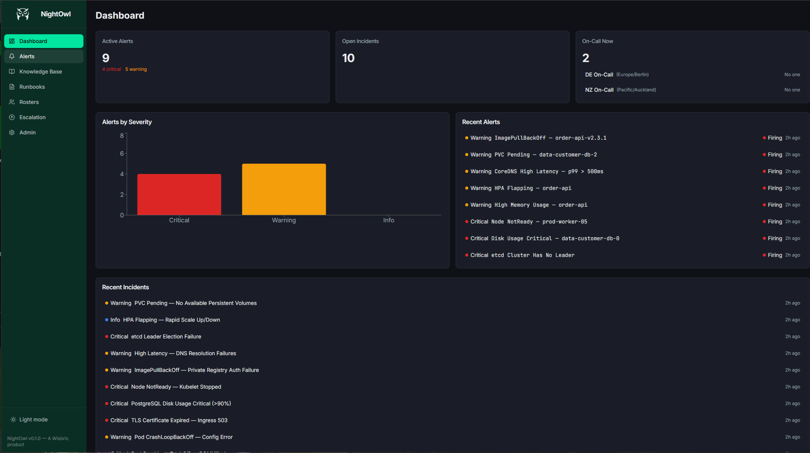

<p align="center">
  
</p>

<h1 align="center">NightOwl</h1>

<p align="center">
  <em>The wise one that watches while you sleep.</em>
</p>

<p align="center">
  <a href="https://wisbric.com"></a>
</p>

---

NightOwl is an incident knowledge base, alert management, on-call roster, and escalation platform built for 24/7 operations teams running Kubernetes infrastructure across multiple time zones. It combines a searchable knowledge base of past incidents with real-time alert ingestion, intelligent deduplication, configurable escalation policies, and follow-the-sun roster management — all in a single, self-hosted binary. It is a [Wisbric](https://wisbric.com) product.

<p align="center">
  
</p>

---

## Features

- **Incident Knowledge Base** — full-text search, merge, history tracking, and runbook linking
- **Alert Ingestion** — webhook receivers for Alertmanager, Keep, and generic sources with Redis-backed deduplication
- **On-Call Rosters** — daily/weekly/custom rotations, follow-the-sun, overrides, and iCal export
- **Escalation Policies** — multi-tier escalation with Slack, SMS, and phone notifications, plus dry-run simulation
- **Runbooks** — Markdown runbooks with templates, linked directly to incidents
- **Multi-Tenancy** — schema-per-tenant PostgreSQL isolation
- **Cookie-Based Sessions** — HttpOnly `wisbric_session` cookie with silent refresh, local admin break-glass login
- **OIDC + API Key Auth** — role-based access control with OIDC, API keys, and cookie sessions
- **Audit Trail** — every API action logged with user, IP, and detail
- **API Documentation** — built-in Swagger UI at `/api/docs`
- **Observability** — Prometheus metrics and OpenTelemetry tracing
- **Dark Mode** — default dark theme optimized for 3am on-call dashboards

## Tech Stack

**Backend:** Go 1.25+, chi, PostgreSQL 16+ (pgx + sqlc), Redis (go-redis/v9), OIDC, OpenTelemetry
**Frontend:** React 19, TypeScript 5.9, Vite 7, shadcn/ui, Tailwind CSS 4, TanStack Query 5

---

## Quick Start

```bash
# Prerequisites: Go 1.25+, Docker, Node.js 20+

# Start infrastructure
docker compose up -d

# Run migrations and seed data
make migrate
make seed-demo

# Start the API server
go run ./cmd/nightowl -mode api

# Start the frontend dev server (separate terminal)
cd web && npm install && npm run dev

# API is at http://localhost:8080, Frontend at http://localhost:3000
# API docs at http://localhost:8080/api/docs
# Dev API key: ow_dev_seed_key_do_not_use_in_production
```

---

## API Endpoints

Full interactive documentation is available at [`/api/docs`](http://localhost:8080/api/docs) (Swagger UI) and the raw OpenAPI spec at [`/api/docs/openapi.yaml`](http://localhost:8080/api/docs/openapi.yaml).

| Method | Path | Description |
|--------|------|-------------|
| `POST` | `/api/v1/webhooks/alertmanager` | Alertmanager webhook receiver |
| `POST` | `/api/v1/webhooks/keep` | Keep webhook receiver |
| `POST` | `/api/v1/webhooks/generic` | Generic JSON webhook |
| `GET` | `/api/v1/alerts` | List alerts |
| `GET` | `/api/v1/alerts/:id` | Alert detail |
| `PATCH` | `/api/v1/alerts/:id/acknowledge` | Acknowledge alert |
| `PATCH` | `/api/v1/alerts/:id/resolve` | Resolve alert |
| `GET` | `/api/v1/incidents` | List incidents |
| `POST` | `/api/v1/incidents` | Create incident |
| `GET` | `/api/v1/incidents/:id` | Incident detail |
| `PUT` | `/api/v1/incidents/:id` | Update incident |
| `GET` | `/api/v1/incidents/search?q=` | Full-text search |
| `GET` | `/api/v1/runbooks` | List runbooks |
| `POST` | `/api/v1/runbooks` | Create runbook |
| `GET` | `/api/v1/rosters` | List rosters |
| `GET` | `/api/v1/rosters/:id/oncall` | Current on-call |
| `POST` | `/api/v1/rosters/:id/overrides` | Add override |
| `GET` | `/api/v1/rosters/:id/export.ics` | iCal export |
| `GET` | `/api/v1/escalation-policies` | List policies |
| `POST` | `/api/v1/escalation-policies/:id/dry-run` | Test escalation |
| `GET` | `/api/v1/audit-log` | Audit log |
| `GET` | `/healthz` | Liveness probe |
| `GET` | `/readyz` | Readiness probe |
| `GET` | `/metrics` | Prometheus metrics |

---

## Documentation

| Document | Description |
|----------|-------------|
| [Requirements](docs/01-requirements.md) | Product requirements and feature matrix |
| [Architecture](docs/02-architecture.md) | System architecture and tech stack |
| [Data Model](docs/03-data-model.md) | PostgreSQL schema and multi-tenancy |
| [Integrations](docs/04-integrations-workflow.md) | Slack, webhooks, Twilio, roster handoff |
| [Tasks](docs/05-tasks.md) | Implementation task breakdown |
| [Branding](docs/06-branding.md) | Design system, colors, typography |
| [Deployment](docs/07-deployment.md) | CI/CD, containers, Helm charts |
| [API Reference](docs/api/openapi.yaml) | OpenAPI 3.0.3 specification |

---

## Configuration

| Variable | Example | Description |
|----------|---------|-------------|
| `NIGHTOWL_MODE` | `api\|worker\|seed` | Runtime mode (default: `api`) |
| `NIGHTOWL_HOST` | `0.0.0.0` | Bind address |
| `NIGHTOWL_PORT` | `8080` | HTTP port |
| `DATABASE_URL` | `postgres://...` | PostgreSQL connection string |
| `REDIS_URL` | `redis://...` | Redis connection string |
| `LOG_LEVEL` | `info` | Log level (`debug`/`info`/`warn`/`error`) |
| `LOG_FORMAT` | `json` | Log format (`json`/`text`) |
| `OTEL_ENDPOINT` | `http://...` | OpenTelemetry collector |
| `OIDC_ISSUER` | `https://...` | OIDC issuer URL |
| `OIDC_CLIENT_ID` | `nightowl` | OIDC client ID |
| `OIDC_CLIENT_SECRET` | `...` | OIDC client secret (required for auth code flow) |
| `OIDC_REDIRECT_URL` | `http://localhost:5173/auth/callback` | OIDC redirect URL |
| `NIGHTOWL_SESSION_SECRET` | `...` | Session signing secret (required unless `DEV_MODE=true`) |
| `DEV_MODE` | `false` | Enables dev-only auth shortcuts |
| `SLACK_BOT_TOKEN` | `xoxb-...` | Slack bot token |
| `SLACK_SIGNING_SECRET` | `...` | Slack signing secret |
| `SLACK_ALERT_CHANNEL` | `#alerts` | Slack alert channel |
| `CORS_ALLOWED_ORIGINS` | `*` | CORS origins (comma-separated). If `*` is used, credentials are disabled. |

---

## Kubernetes Deployment

```bash
helm install nightowl deploy/helm/nightowl \
  --set secrets.databaseUrl="postgres://..." \
  --set secrets.redisUrl="redis://..." \
  --set ingress.enabled=true \
  --set ingress.hosts[0].host=nightowl.example.com
```

---

## Slack App Setup

1. Create a Slack app at [api.slack.com](https://api.slack.com).
2. Enable the **Events API** and subscribe to: `app_mention`, `message.channels`.
3. Add a slash command: `/nightowl`.
4. Enable **Interactivity** with the request URL: `https://your-domain/api/v1/slack/interactions`.
5. Set the event subscription URL: `https://your-domain/api/v1/slack/events`.
6. Add bot token scopes: `chat:write`, `commands`, `channels:read`, `users:read`.
7. Set the following environment variables:
   - `SLACK_BOT_TOKEN`
   - `SLACK_SIGNING_SECRET`
   - `SLACK_ALERT_CHANNEL`

---

## Authentication

NightOwl supports multiple authentication methods, all handled by the shared `core/pkg/auth` middleware:

1. **Cookie sessions** (`wisbric_session`) — HttpOnly, Secure, SameSite=Strict cookies set on login. Used by browser clients. Silent refresh when token has <2h remaining.
2. **OIDC/OAuth2** — compatible with **Keycloak**, **Dex**, **Auth0**, or any standard OIDC provider. Set `OIDC_ISSUER` and `OIDC_CLIENT_ID` (and `OIDC_CLIENT_SECRET` + `OIDC_REDIRECT_URL` for the auth code flow).
3. **Local admin** — break-glass username/password login at `/auth/local`. Created on seed. Forced password change on first login.
4. **API keys** — `X-API-Key` header for service-to-service and webhook senders.
5. **Dev header** — `X-Tenant-Slug` header fallback (requires `DEV_MODE=true`).

**Middleware precedence:** Cookie → PAT → Session JWT (Bearer) → OIDC JWT (Bearer) → API Key → Dev header.

---

## Development

```bash
make build          # Build binary
make test           # Run tests
make lint           # Run linter
make sqlc           # Regenerate sqlc code
make migrate-up     # Run global migrations
make seed           # Seed development data
make seed-demo      # Seed comprehensive demo data
make docker         # Build Docker image
```

---

## Project Structure

```
cmd/nightowl/           Application entry point
internal/
  app/                   Application bootstrap
  authadapter/           Auth storage adapter (implements core auth.Storage)
  config/                Configuration loading (extends core BaseConfig)
  audit/                 Audit log writer
  db/                    sqlc generated code
  docs/                  Swagger UI + OpenAPI spec handler
  httpserver/            HTTP server + middleware
  platform/              Database + Redis clients
  seed/                  Development seed data
  telemetry/             Logging, metrics, tracing
pkg/
  alert/                 Alert engine (webhooks, dedup, enrichment, lifecycle)
  escalation/            Escalation policies and engine
  incident/              Knowledge base CRUD + search
  integration/           Twilio callout stubs
  roster/                On-call schedules, overrides, iCal
  runbook/               Runbook templates
  slack/                 Slack bot integration
  tenant/                Multi-tenancy middleware
web/                     React frontend (Vite + TypeScript)
docs/
  api/                   OpenAPI 3.0.3 specification
deploy/
  helm/nightowl/         Helm chart
  grafana/               Grafana dashboard
migrations/
  global/                Global schema migrations
  tenant/                Per-tenant schema migrations
```

---

## License

Copyright Wisbric. All rights reserved.

---

<p align="center">
  A <a href="https://wisbric.com">Wisbric</a> product
</p>
